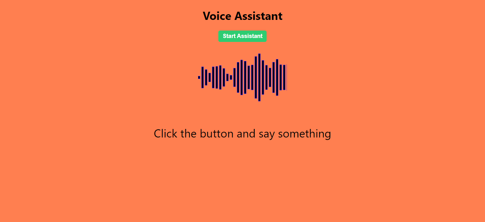

# Javascript voice assistant
This project uses tensorflow's speech commands model to understand users words and predict the actions that a user intends on performing. For enhanced user experince, wave visualizer library is used to show waveforms of sounds in the surrounding environment.

## Pretrained model
A model was trained using [google's trainable machine](https://teachablemachine.withgoogle.com/train)
The model recognizes the followiing lables:
    1. Background Noise
    1. Greetings: Responds to greetings
    1. Play a Song: Tells a user the recommended songs for the day
    1. Weather: Tells the user the current weather
The actual functionality for this has not been included but the browser responds using SpeechSynthesisUtterance function to convert text to speech.

### Voice Assistant


## Imports
```js
//tesorflowjs
import * as tf from '@tensorflow/tfjs'
//speech commands model
import * as speech from '@tensorflow-models/speech-commands'

```

## Load Model
```js
// voice model is the pretrained model from teachable machine
// voice metadata is the metadata of the trainable machines
 const recognizer = await speech.create('BROWSER_FFT', undefined, VoiceModel, VoiceModelMetadata)
 //ensure the model is loaded before proceeding
      await recognizer.ensureModelLoaded()
      setModel(recognizer)
// set the word lables: Background Noise, Greetings, Play a Song, Weather
      setLabels(recognizer.wordLabels())

```

## Predict User commands
```js
model.listen(result => {
    //set the actions to the highest value in the prediction based on the four word labels
      setAction(labels[argMax(Object.values(result.scores))])
    }, {
      includeSpectrogram: true, 
      probabilityThreshold: 0.7, // set the probability threshold of a prediction
      invokeCallbackOnNoiseAndUnknown: true,
      overlapFactor: 0.50 
    })
    //stop predictions after 10 seconds
    setTimeout(() => model.stopListening(), 10e3)
```
## Speech synthesis 
Use browser speech synthesis to convert text to speech

```js
 function speak(text){
    try {
      const speech = new window.SpeechSynthesisUtterance(text)
      window.speechSynthesis.speak(speech)  
    } catch (error) {
      alert("speech syntesis not supported by your browser. Plaese update...")
    }
  }
```
